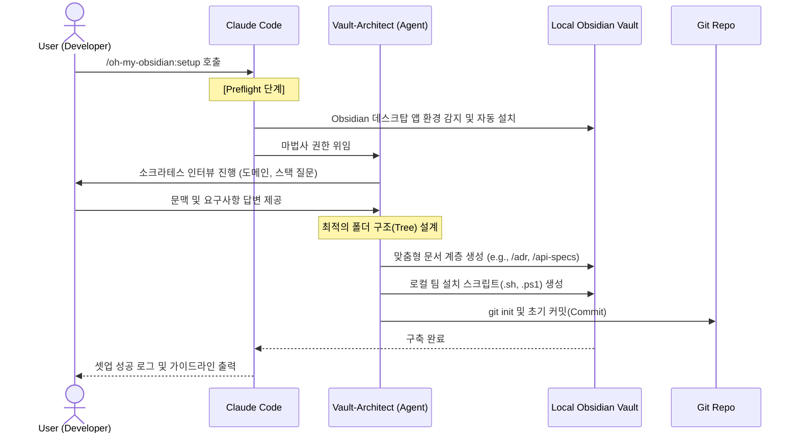
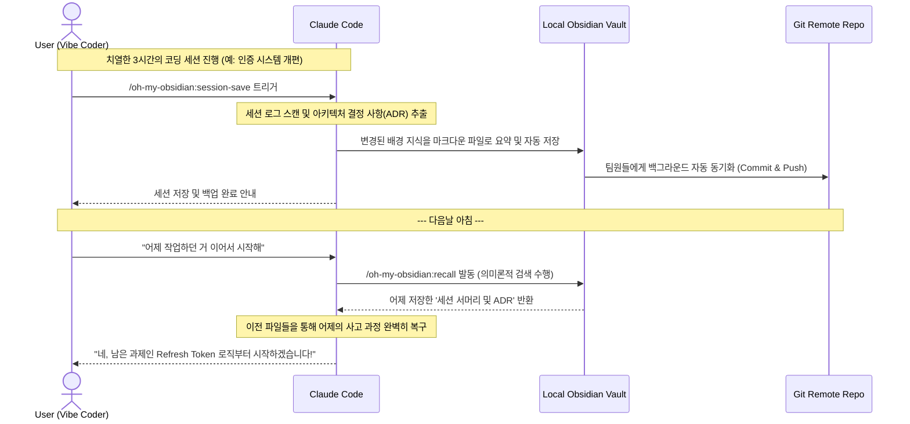

# Oh-My-Obsidian: 워크플로우 다이어그램 (Workflows)

이 문서는 `oh-my-obsidian` 플러그인의 핵심 사용 시나리오를 시각화한 구조도입니다.

## 🏃 시나리오 1: 두 번째 뇌 초기화 (Setup Workflow)

초기 폴더를 기획하고 팀 동기화 환경을 구성하는 설치 마법사 워크플로우입니다.

 

## 💾 시나리오 2: 바이브 코딩과 지식 아카이빙 (Work & Session-Save Workflow)

치열한 코딩 세션을 마친 후 의사결정을 자동 문서화하고, 다음날 다시 기억을 살려내는 과정입니다.

